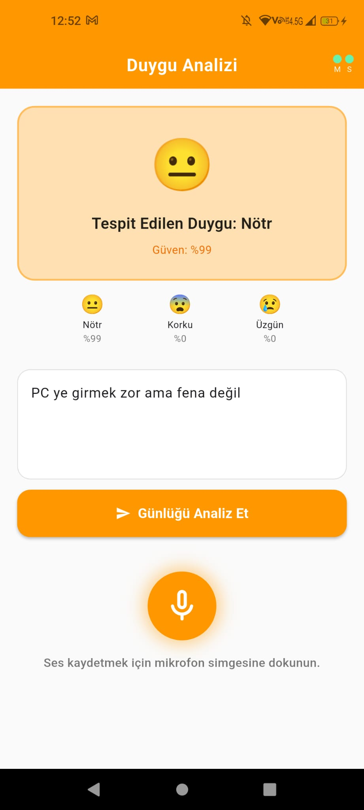
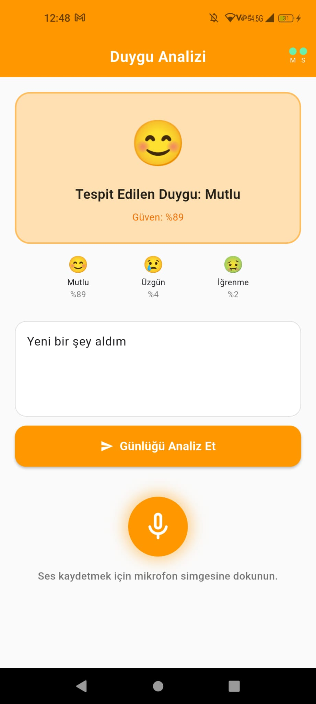
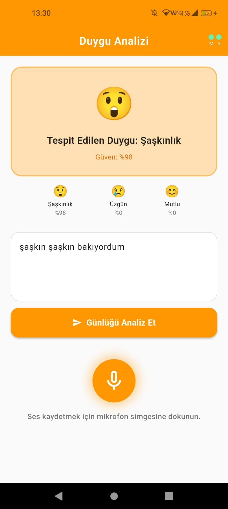
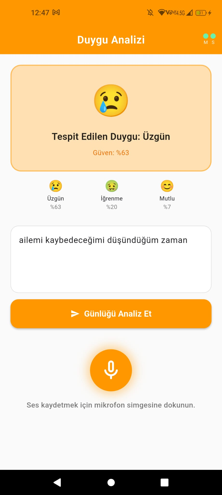
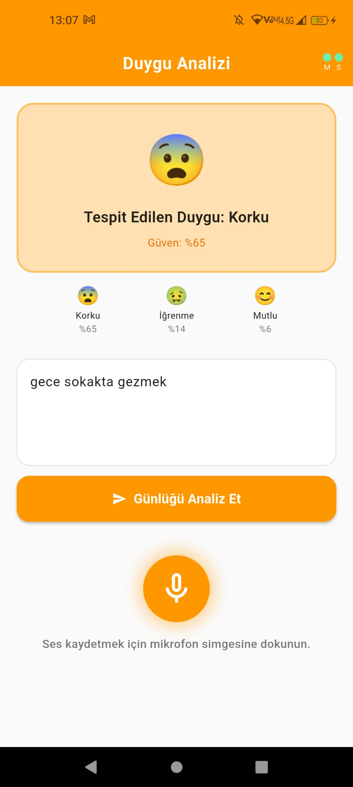
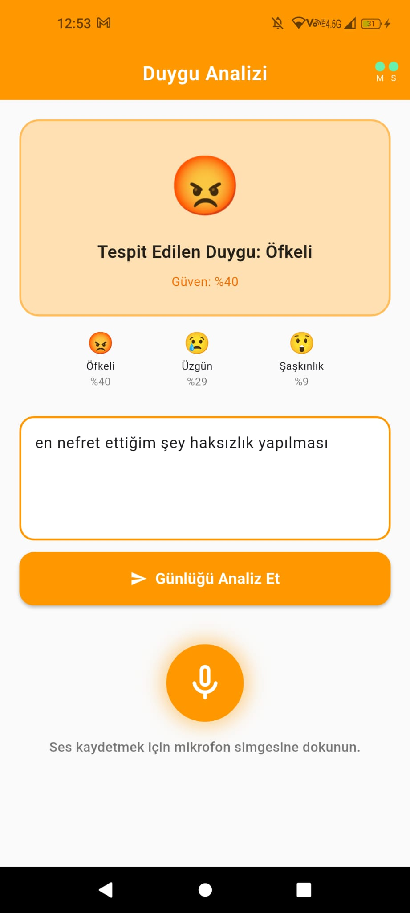

# 🧠 Ses ve Metin Verilerinden Çok Modlu Duygu Analizi (Multimodal Emotion Analysis)

Bu proje, kullanıcıların yazılı metinlerinden ve ses kayıtlarından duygu durumlarını analiz edebilen yapay zeka destekli bir mobil uygulamadır. Geliştirilen derin öğrenme modelleri (CNN-LSTM ve 2D-CNN), psikoloji literatürüne dayanan 7 temel duygu kategorisini sınıflandırmak üzere eğitilmiş ve TensorFlow Lite formatına dönüştürülerek Flutter tabanlı mobil arayüze entegre edilmiştir.

## 🎯 Özellikler

- **Yazılı Günlük Analizi:** Kullanıcının girdiği metinleri Zemberek kütüphanesi ile morfolojik olarak işleyerek hibrit CNN-LSTM mimarisiyle duygu analizi yapar.
- **Sesli Kayıt Analizi:** Kullanıcı seslerinden Librosa kullanılarak Mel-Spektrogram haritaları çıkarılır ve 2D-CNN mimarisi ile akustik tonlama/vurgu analizi gerçekleştirilir.
- **7 Temel Duygu Tespiti:** Mutlu, Nötr, Üzgün, Öfkeli, İğrenme, Korku, Şaşkınlık.
- **Gerçek Zamanlı Çıkarım (Inference):** Optimize edilmiş `.tflite` modelleri sayesinde bulut bağlantısına gerek kalmadan doğrudan cihaz üzerinde (~47ms gecikme ile) hızlı analiz.
- **Kullanıcı Dostu Arayüz:** Psikoloji literatüründe pozitifliği temsil eden turuncu renk temalı, akıcı ve sezgisel Flutter arayüzü.

## 📸 Uygulama İçi Ekran Görüntüleri

Modelin canlı testlerde farklı duygu durumlarını başarıyla analiz ettiği bazı kullanım senaryoları:

  
  
  

  
  
  

## 🛠️ Kullanılan Teknolojiler

**Mobil Geliştirme (Frontend):**
- Flutter & Dart
- `tflite_flutter` (TensorFlow Lite entegrasyonu için)

**Yapay Zeka ve Veri Bilimi (Backend/AI):**
- Python, TensorFlow / Keras (Model tasarımı ve eğitimi)
- Zemberek-NLP (Türkçe morfolojik analiz ve metin normalleştirme)
- Librosa (Ses sinyali işleme ve Mel-Spektrogram dönüşümü)
- Scikit-learn, Pandas, NumPy (Veri seti manipülasyonu)

## 🏗️ Model Mimarisi ve Performans

Projede iki bağımsız yapay zeka modeli modüler olarak çalışmaktadır:

1. **Metin Analizi Modeli (CNN-LSTM):** - Türkçenin sondan eklemeli yapısını çözmek için paralel N-gram CNN katmanları ve bağlamsal ilişki için ardışık LSTM katmanları kullanılmıştır.
   - **Başarı Oranı:** ~%88 (Doğrulama Seti)
2. **Ses Analizi Modeli (2D-CNN):** - 128x128 boyutlar
   - **Başarı Oranı:** ~%35 (Doğrulama Seti)
   - Geliştirme önerilerine açığız 😎

## Geliştiriciler
- Şerife Nazlı Ünay
- Firdevs Tosun
